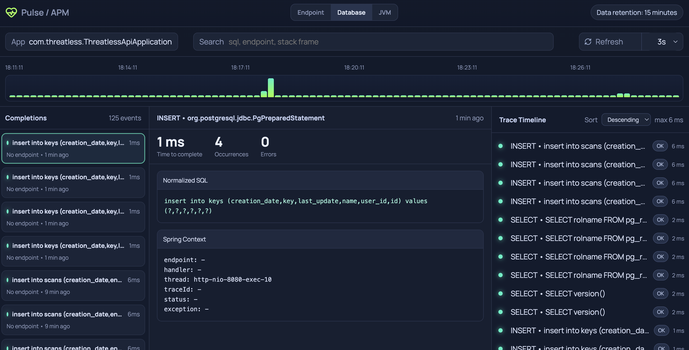

# PULSE - Local Java APM Agent (Spring Boot 3+)



Local, offline Java APM with no external service.

PULSE attaches as a `-javaagent` when a Java/Spring Boot application starts, collects SQL/HTTP/JVM metrics, and exposes a simple local web UI.

## Why this project

- Zero external collector
- Single agent JAR
- 100% local execution

## Features

- SQL collection:
  - JDBC query instrumentation (`Statement` / `PreparedStatement`)
  - SQL type, duration, errors, Spring context
  - SQL <-> HTTP endpoint correlation (`traceId`, thread+time fallback)
- HTTP collection:
  - endpoint transactions (method + path)
  - status, duration, errors
  - sampled stack hotspots + call stacks
  - request metadata: query params, headers (sensitive filtering), auth (masked), body (best effort)
- JVM collection:
  - heap, process CPU, threads, GC count, GC pause
  - average HTTP latency and p95
- Built-in local UI:
  - Endpoint tab
  - Database tab
  - JVM tab

## Prerequisites

- Java 17 to 25
- Maven (or `./mvnw`)
- Target application: Spring Boot `>= 3.0` (Jakarta Servlet only), started with `-javaagent`

## Build

```bash
./mvnw clean package
```

Generated agent JAR:

```text
target/pulse-1.0.0-agent.jar
```

## Quick start

### 1) Build the PULSE agent

```bash
cd /path/to/pulse
./mvnw clean package
```

### 2) Start your Spring Boot application with the agent

```bash
java \
  -javaagent:/path/to/pulse/target/pulse-1.0.0-agent.jar=port=17321 \
  -jar /path/to/your-app.jar
```

### 3) Open the PULSE UI

- [http://127.0.0.1:17321](http://127.0.0.1:17321)

## `-javaagent` configuration

Format:

```text
-javaagent:/path/pulse-agent.jar=key=value,key=value,...
```

Supported keys:

- `port` (default `17321`)
- `bind` (default `127.0.0.1`)
- `retentionMs` (default `900000`, i.e. 15 min)
- `slowMs` (slow SQL threshold, default `300`)
- `slowHttpMs` (slow HTTP threshold, default `500`)
- `sampleRate` (0.0 to 1.0, default `1.0`)
- `appName` (monitored app name, fallback if auto-detection fails)

Important:

- If the port is already in use, PULSE fails fast with an explicit message.
- PULSE does not require any database to run.

## Exposed API

Local base URL: `http://127.0.0.1:<port>`

- `GET /api/sql/snapshot`
- `GET /api/sql/config`
- `GET /api/http/snapshot`
- `GET /api/http/trace/{id}`
- `GET /api/jvm/snapshot`
- `GET /` (UI)

## Security and captured data

- Sensitive headers excluded:
  - `Authorization` (masked value in `auth`)
  - `Proxy-Authorization`
  - `Cookie`
  - `Set-Cookie`
- Request body:
  - best-effort capture (especially JSON)
  - truncated to limit size
  - binary content ignored
- SQL:
  - bind values are intentionally not captured

## Architecture (summary)

- Agent bootstrap:
  - `src/main/java/com/pulse/agent/PulseAgent.java`
- Instrumentation:
  - HTTP: `src/main/java/com/pulse/agent/instrumentation/HttpTransactionSupport.java`
  - SQL: `src/main/java/com/pulse/agent/instrumentation/StatementExecutionAdvice.java`
- Runtime/metrics:
  - `src/main/java/com/pulse/app/core/PulseRuntime.java`
  - `src/main/java/com/pulse/app/core/SqlCollectorService.java`
  - `src/main/java/com/pulse/app/core/HttpPerfCollectorService.java`
  - `src/main/java/com/pulse/app/core/JvmMetricsService.java`
- UI:
  - `src/main/resources/static/index.html`

## Development

Run tests:

```bash
./mvnw test
```

Verify packaging:

```bash
./mvnw package
```

## Troubleshooting

### No HTTP data is collected

- Ensure the target app is started with `-javaagent`.
- Fully restart the target JVM after changing the agent.
- Ensure the PULSE port is reachable.

### HTTP body is not shown

- Capture is best effort and is not guaranteed for all flows/proxies/filters.
- Ensure the request goes through Spring MVC.
- Ensure content type is text/JSON (not binary).

### Port already in use error

- Change `port` in `-javaagent` args, for example:
  - `port=17322`

## Contribution

Issues and PRs are welcome.

Recommended guidelines:

- Keep the project free of dependencies
- Preserve local startup simplicity
- Add/update tests for each instrumentation change

## License

Apache License 2.0. See [LICENSE](./LICENSE).
